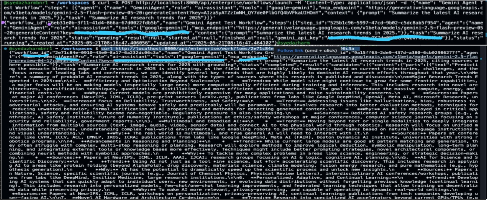

This screenshot shows a successful POST and GET to the `/api/enterprise/workflows/launch` and `/api/enterprise/workflows/{id}` endpoints, with a Gemini agent completing a grounded AI research summary task. The workflow status is `completed` and the Gemini model returned a detailed, cited summary as expected.

---

**Commit message for PR:**

feat: Enterprise multi-agent workflow orchestrator with Gemini integration

- Add enterprise-level orchestrator supporting multi-agent workflows via MCP
- Integrate Google Gemini API as a first-class agent (configurable via env)
- Demonstrate successful workflow execution and result retrieval (see screenshot)
- Example: AI research trends summary with citations using Gemini 2.5

---

**How to test:**
1. Start the FastAPI app: `uvicorn cli:fastapi_app --reload --host 0.0.0.0 --port 8000`
2. POST a workflow with a Gemini agent to `/api/enterprise/workflows/launch`
3. GET the workflow status/result from `/api/enterprise/workflows/{workflow_id}`

---

**Screenshot:**

